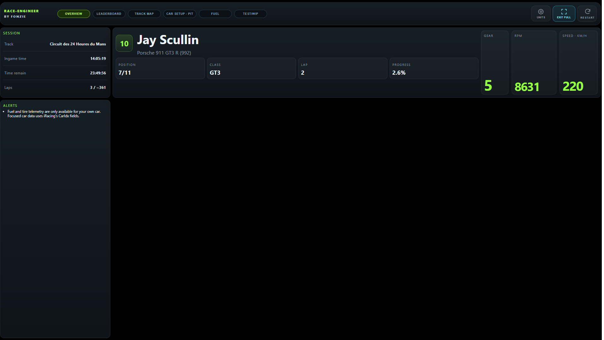
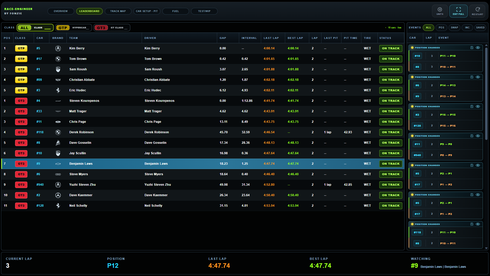
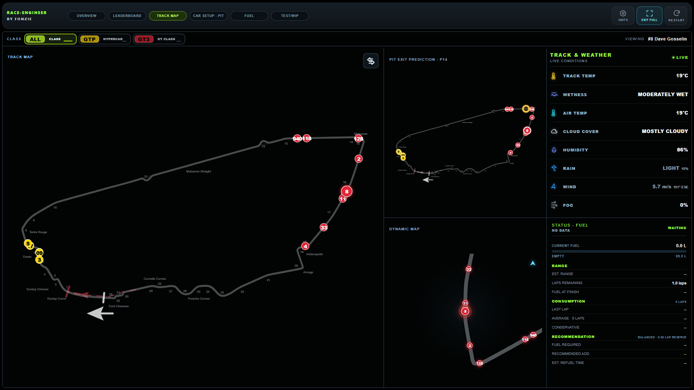
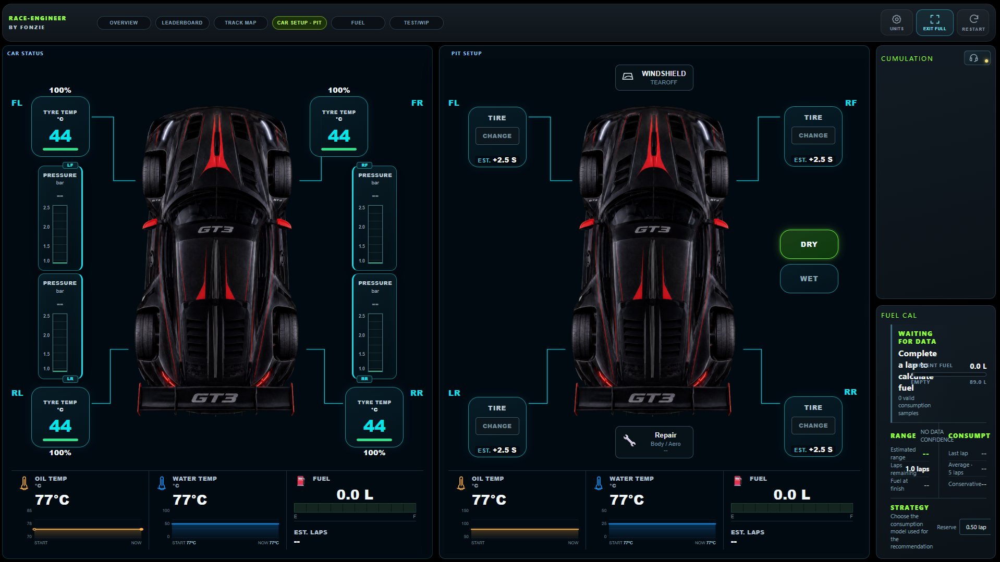
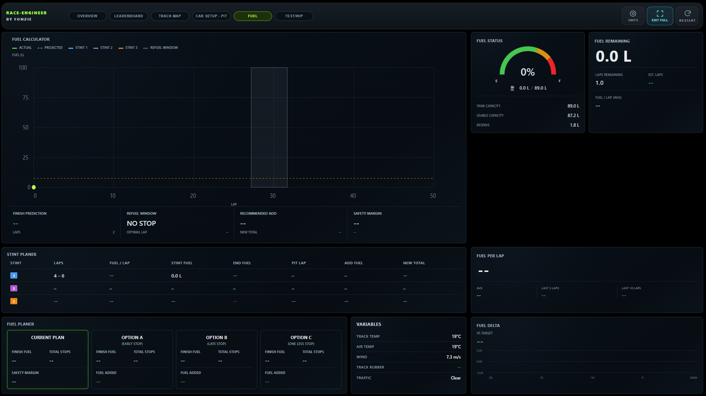
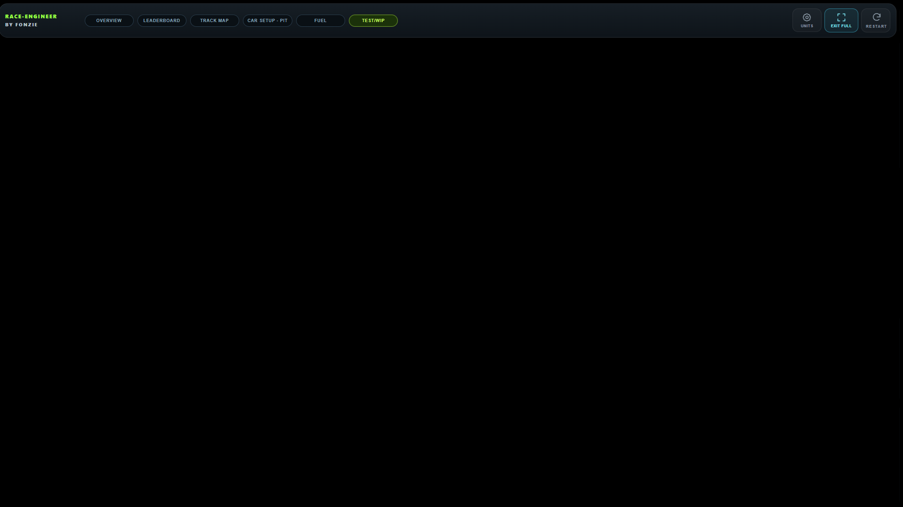

# Race-Engineer

## About

A real-time dashboard for sim racers who want a virtual race engineer and pit
crew at their side. Monitor critical vehicle telemetry, track race conditions,
analyse performance and make smarter strategy decisions throughout every session.

[Download the latest **Race-Engineer.msi**](https://github.com/FonzieDK/Race-Engineer/releases/latest/download/Race-Engineer.msi)
| [View the changelog](CHANGELOG.md)

## Requirements

- Windows 10 or 11 (64-bit)
- iRacing installed
- An active iRacing session for live telemetry and simulator controls

The MSI includes Electron, Node.js and the Python runtime. Users installing the
MSI do not need to install those tools separately.

## Features & data

### Overview



_Overview with session data, the focused car and live car health. Values shown in
the screenshots are examples from an iRacing session._

- Session time, in-game time, lap count and circuit
- Focused driver, car, class position, lap progress, gear, RPM and speed
- Per-corner tyre temperature, pressure and wear
- Per-corner brake temperature and colour-coded condition indicators
- Live oil and water temperatures with recent history
- Fuel level, battery voltage and race-engineering alerts
- Configurable speed, temperature, pressure and fuel units

### Leaderboard & events



_Multi-class standings and the live race-event feed._

- Overall and class position, car, team and driver
- Gap, interval, current lap, last lap and best lap
- Last pit lap, pit duration, tyre compound and track status
- Multi-class filters with live car counts and class colours
- Mouse and keyboard selection of the focused iRacing camera car
- Position changes, driver swaps and incidents in the event feed
- Saved events and timed replay playback with automatic return to live data
- Background event collection after the dashboard window is closed

### Track map & weather



_Live circuit map, pit-exit prediction and track conditions._

- Official iRacing circuit layout with car numbers and class colours
- Focused-car highlighting, pit-lane status and class filtering
- Smooth 60 Hz car-position updates
- Pit-exit traffic prediction
- Rotating follow map with speed-dependent zoom
- Track temperature, wetness, rubber state and declared-wet status
- Air temperature, skies, humidity, precipitation, fog and wind

### Car setup & pit



_Live car status and pit-service configuration._

- Select individual tyre changes and supported tyre compounds
- Set target tyre pressures and refuelling amount
- Configure windscreen tear-off and supported pit services
- Send supported pit commands directly to iRacing from the local dashboard

### Fuel (WIP)



_Work-in-progress fuel calculator and stint-planning dashboard._

- Fuel range, recent consumption and fuel-at-finish estimates
- Recommended fuel add and safety-margin calculations
- Stint planning, refuelling windows and strategy alternatives

### Test (development)



_The Test/WIP screen is reserved for development and experimental features._

### Desktop tools

- Open Overview, Leaderboard, Track Map and Pit Setup as independent always-on-top overlays
- Resize overlays and control their opacity, fullscreen state and position lock
- Persist overlay size, position and preferences between launches
- Optional background collector start with Windows

> [!NOTE]
> Available telemetry varies by car and session. Tyre wear, pressure, fuel,
> battery and some pit controls may only be available for the driver's own car
> or for cars that expose the corresponding iRacing SDK fields.

## Data flow and storage

Race-Engineer reads the local iRacing SDK feed. The Python service exposes the
processed snapshot only to the Electron dashboard on `127.0.0.1`; this local-only
binding is important because the API can send supported commands to the simulator.

Development event data is stored in `sql/events.db`. An installed app stores
configuration, logs, overlay state and the event database under
`%APPDATA%\Race-Engineer`. Closing the dashboard does not stop an already running
event collector, and a single-instance lock prevents duplicate collectors.

## Install and run

For normal use, download and run the MSI linked above. It creates Start menu and
desktop shortcuts.

To run from source:

```powershell
python -m pip install -r requirements/runtime.txt
npm install
npm start
```

## Build the Windows installer

The build computer requires Python, Node.js LTS and WiX Toolset 3.14:

```powershell
npm run make:msi
```

The finished 64-bit MSI is written below `out/make/`.

## Development checks

Install runtime and build dependencies, then run the same checks used by CI:

```powershell
python -m pip install -r requirements/runtime.txt -r requirements/build.txt
npm ci
npm run check
```

See [Project structure](docs/PROJECT_STRUCTURE.md) for a directory overview.

## Troubleshooting

- Start or join an iRacing session before expecting live data.
- If the dashboard remains disconnected, restart Race-Engineer and verify that
  iRacing has an active session.
- If a source checkout is missing Python dependencies, run
  `python scripts/setup_iracing_env.py`.
- If Electron does not open from a source checkout, run `npm install` and try
  `npm start` again.

## Roadmap

- Extended pit-strategy calculations
- Session-data export and post-race analysis
- Additional real-time strategy recommendations
