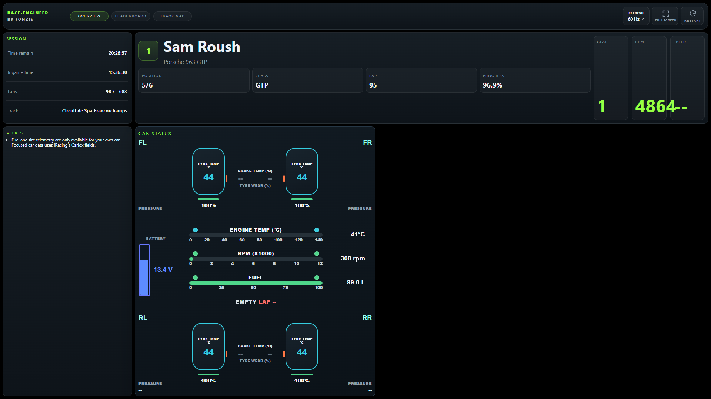
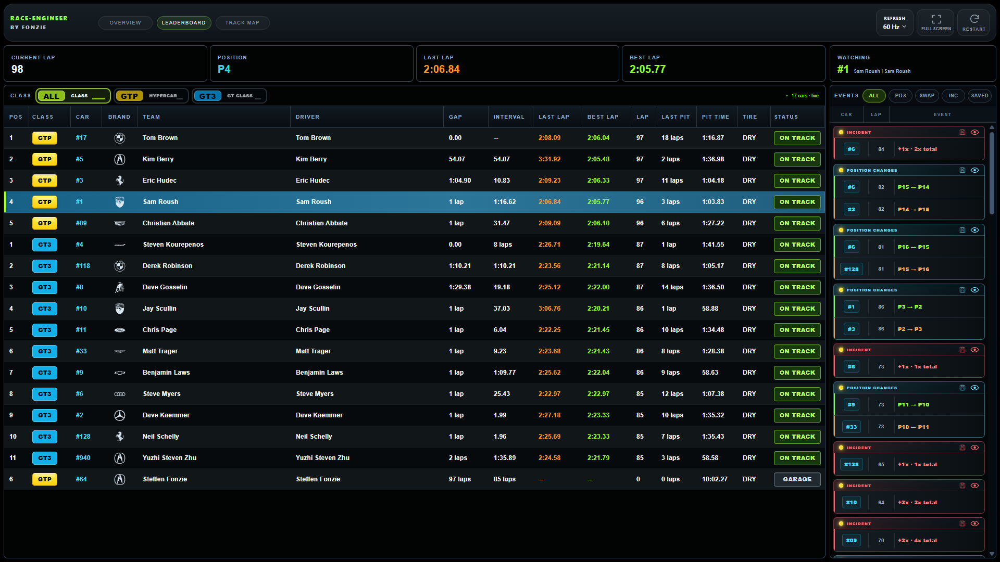
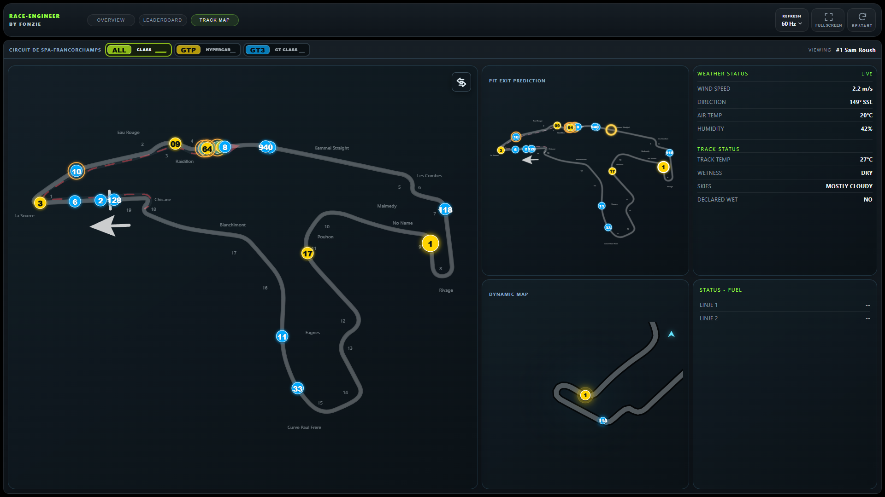

# Race-Engineer

Race-Engineer is an Electron desktop app for real-time iRacing telemetry with a Python backend.

## Download

[Download **Race-Engineer.msi**](https://github.com/FonzieDK/Race-Engineer/releases/latest/download/Race-Engineer.msi)

## Requirements

- Windows 10 or 11 (64-bit)
- iRacing installed
- iRacing running when live telemetry is required

The MSI installer includes Electron, Node.js, and the Python runtime. Installed users
do not need to install these tools separately.

## Windows MSI installer

Build a 64-bit Windows installer from PowerShell:

```powershell
npm run make:msi
```

The build requires Python, Node.js LTS, and WiX Toolset 3.14 on the build PC. The
finished `.msi` is written below `out/make/`. Installed users do not need Python,
Node.js, Electron, or WiX. The installer creates Start-menu and desktop shortcuts.
Writable configuration, logs, and the event database are stored below the current
user's `%APPDATA%\Race-Engineer` directory rather than in `Program Files`.

To save local changes to GitHub, double-click `scripts/commit_to_github.bat`. Enter a commit
message, or press Enter to use the default. The script commits the changes, synchronizes
with `main`, and pushes them to `FonzieDK/Race-Engineer`.

The event collector keeps running after the Race-Engineer window is closed. It reads the local
iRacing SDK feed, so closing Electron does not interrupt event collection. Its single-instance
lock prevents duplicate collectors. A normal launch registers a collector-only Windows login
start, so later reboots restart collection without opening the Race-Engineer window. Development
data is stored in `sql/events.db`; an installed app stores it in
`%APPDATA%\Race-Engineer\sql\events.db`.

## OVERVIEW



### Features

- Live session information, including time remaining, in-game time, lap count, and track name
- Focused driver and car details with class position, completed laps, lap progress, gear, RPM, and speed
- Live race-engineering and strategy alerts
- Per-corner tyre temperatures, pressures, and wear with colour-coded status indicators
- Per-corner brake temperatures plus engine-temperature and RPM monitoring
- Live fuel level with an estimated fuel-empty lap
- GTP battery-voltage monitoring when supported by the selected car

## LEADERBOARDS



### Features

- Focused-car summary with current lap, position, last lap, and best lap
- Live standings with class position, car and team details, gaps, intervals, lap times, pit information, tyre compound, and race status
- Multi-class filtering with live car counts and class-specific colours
- Clickable and keyboard-accessible rows for changing the focused iRacing camera car
- Race-event feed for position changes, driver swaps, incidents, and saved events
- Event saving and timed replay playback with an automatic return to the live session
- Background event collection that continues after the dashboard window is closed

## TRACK MAP



### Features

- Official iRacing circuit layout with live, colour-coded car positions and car numbers
- Focused-car highlighting, pit-lane status, and multi-class map filtering
- Smooth 60 Hz map updates for close real-time tracking
- Pit-exit traffic prediction showing where the focused car is expected to rejoin
- Dynamic follow map with smooth rotation and speed-dependent zoom around the focused car
- Switchable large-map view between the track map, pit-exit prediction, and dynamic follow map
- Live weather and track conditions, including wind, temperature, humidity, wetness, skies, and declared-wet status

## Configuration

Edit `config.json` to adjust settings:

- `host`: Backend bind address; the default `127.0.0.1` keeps access local to this PC
- `port`: Backend HTTP port
- `refresh_rate`: Telemetry update interval in seconds
- `ui_refresh_rate_ms`: Browser fallback-polling interval in milliseconds
- `tire_wear_warning`: Threshold used by the tyre-wear alert, expressed from 0 to 1
- `pit_loss_seconds`: Base time loss used by the pit-exit prediction
- `fuel_fill_rate_lps`: Estimated refuelling speed in litres per second
- `tire_change_seconds`: Estimated tyre service time when tyres are selected in iRacing's F5 black box

## Future Enhancements

- Advanced pit strategy calculations
- Data logging and analysis
- Real-time strategy suggestions

## Troubleshooting

- Ensure iRacing is running before starting Race-Engineer.
- If connection fails, check that iRacing has an active session and restart the app.
- For issues with dependencies, try reinstalling with `python scripts/setup_iracing_env.py`.
- If Electron does not open, make sure Node.js is installed and run `npm install`.
